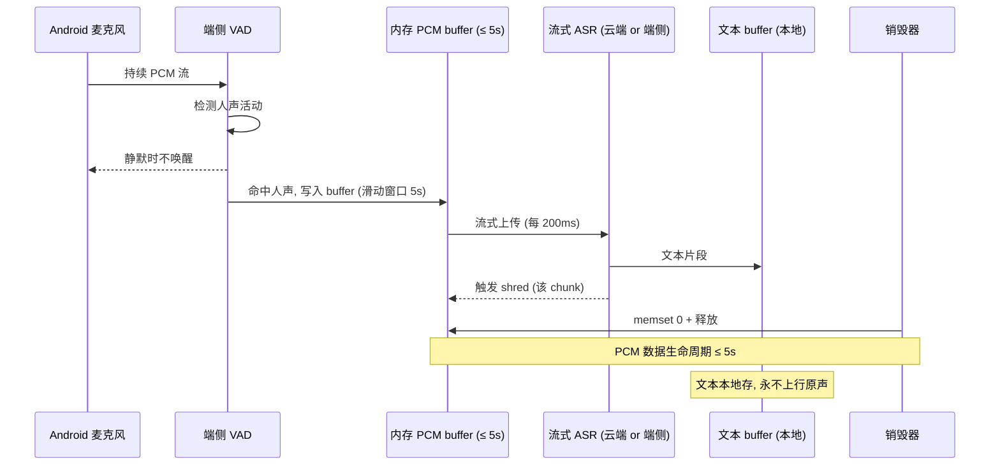

# Life Crutch（占位名 **LiveT**）— 产品设计方案 v0.1

> 基于 Android（兼容跨平台设计）
> 编写日期：2026-05-02
> 适用阶段：阶段 0 MVP（0–3 个月）+ 阶段 1 早期能力前瞻
> 约束：1 个全栈工程师 + AI 编程工具 + ¥10 万预算 + 3 个月
> 配套文件：`docs/prompts/` 目录下 4 个场景 prompt + 通用 prompt + 评估集

---

## 0  引言：设计原则与铁律自检清单

### 0.1 4 条铁律的设计含义（每条都给"具体动作"）

| # | 铁律 | 设计动作 | 反向自检题 |
|---|---|---|---|
| 1 | AI 主动获取上下文，用户只说"当下" | 任何场景启动后，**第一帧 UI 就显示"我已经知道 X、Y、Z"**（来自记忆引擎），永远不要让用户重新讲一遍 | "用户启动这个场景，是否还要先 typing 解释？" |
| 2 | 被动提示，不期待回应 | 提示气泡 / 耳机声音 **永不带'？'**、永不要求点击或回复；用户可以完全忽略 | "这个提示是否在等用户点击 Yes/No？是 → 改成纯告知形态" |
| 3 | 数据本地优先，永不保留原声 | 隐私状态条**永远在场景进行中页顶部可见**；原声内存 buffer 写完即销毁；无云端用户库 | "这条数据是否进了网关？为什么必须进？" |
| 4 | 场景识别渐进自动化 | V1 MVP 全部场景都是用户**手动启动**；不在 V1 做"自动判断该用哪个场景包" | "这个交互是否要求 AI 替用户'决定要不要监听'？是 → 推迟到 V2" |

### 0.2 "Android 优先 + 兼容设计"的取舍边界

| 层 | 设计策略 |
|---|---|
| **视觉层（颜色/字号/图标）** | 中性现代风格，**不深度绑定 Material 3** 的特有装饰元素（如 Material You 动态色彩），便于未来 iOS 复用。色彩向"在场感"靠拢：低饱和度的青蓝/暖灰 |
| **交互层（导航/手势）** | 主导航用底部 Tab（Android/iOS 都通用），不用 Navigation Drawer 这种 Android 重型形态 |
| **形态层（弹窗/抽屉）** | 用通用模态而非 Android 特色 Bottom Sheet，便于 RN/Flutter 跨平台 |
| **实现层（前台服务/通知/权限/ROM 适配）** | **完全 Android 化**，单独写在第 11 章 |

### 0.3 关键术语对齐

- **场景包（Scenario Pack）**：一组围绕特定"重要时刻"的能力组合，含触发方式、监听规则、提示模板、记忆抽取规则、复盘模板。
- **三模式（Mode）**：🟢 主动询问 / 🟡 被动提示 / 🔴 守护监听，是"AI 怎么和你互动"的不同档位，与"场景包"正交。
- **记忆引擎（Memory Engine）**：本地 SQLite + sqlite-vec，把场景里聊到的事件/人物/情绪/未决事项结构化存下来，下次决策时自动 RAG 给上下文。
- **隐私引擎（Privacy Engine）**：保证"永不保留原声 + 数据本地 + 用户可控"的一组机制，不是单一模块而是横跨 ASR、记忆引擎、UI 状态条的工程承诺。

### 0.4 本文档结构与建议阅读顺序

完整 review：第 0 → 1 → 4 → 7 章是哲学层最容易出偏差的，**建议优先 review 这 4 章**。其他章节（2/3/5/6/8/9/10/11/12/13）可后置 review。

---

## 1  三种交互模式 UX

### 1.1 🟢 主动询问模式（默认开启）

**触发**：耳机短按 1 次 / App 浮窗按钮 / Android 快捷设置 tile / 锁屏快捷方式
**形态**：用户问 → AI 答（对标豆包）
**与豆包的差异**：每次对话**自动注入跨场景记忆**——例：用户说"那个 offer 我该接吗"，AI 不问"什么 offer"，而是从记忆引擎检索"最近一周谈过的 A/B/C 公司 offer"，直接给多角度分析。
**铁律自检**：✅ 1（自动调上下文）✅ 3（对话内容存本地 SQLite）

```
[ 用户耳机短按 ]
        ↓
[ App 唤起 + 麦克风开启 + 屏显: "在听..." ]
        ↓
[ 用户说话: "那个 offer 我该接吗" ]
        ↓
[ ASR 流式 → LLM (注入 RAG: 最近一周相关记忆) ]
        ↓
[ TTS 回复 + 屏显文字 + 写入今日对话记录 ]
```

### 1.2 🟡 被动提示模式（V1 核心）

**触发**：用户进入"重要时刻"前，从首页或场景启动页一键进入；选场景包；选提示通道；按"开始"
**形态**：持续 VAD 监听 → 流式 ASR → LLM 分析 → 判断"现在是否值得提示" → 命中阈值才发提示

#### 双通道协同（用户对齐：耳机声音 + 手机字幕）

| 优先级 | 触发条件 | 通道 | 形态 |
|---|---|---|---|
| **高**（关键风险/紧急建议）| LLM 标记 `priority=high` | 耳机声音 + 手机字幕 | 短促双声"叮·叮" + 浮窗气泡 5s |
| **中**（建议/参考）| LLM 标记 `priority=mid` | 仅手机字幕 | 通知栏字幕，无声 |
| **低**（背景信息）| LLM 标记 `priority=low` | 仅耳机轻提示 | 单声"叮"，不打开屏 |

#### 提示节奏防打扰

- **最小间隔**：相邻两条提示间隔 ≥ 30s（用户可在设置里调 15s/30s/60s/120s）
- **相邻去重**：30s 内语义相似度 ≥ 0.85 的提示自动合并
- **自动学习降级**：连续 5 次"被忽略"（用户没点 / 没看屏）→ 自动降级阈值 +0.1（更严格才发）；连续 3 次"被点击查看详情"→ 阈值 -0.05
- **物理静音**：耳机连接中断时所有耳机通道自动转为字幕；用户主动按"暂停"立即停止 VAD

**铁律自检**：✅ 2（永不开口、永不期待回应）✅ 3（原声不留）

#### 进行中页核心信息架构（详见第 3.3 节）

```
┌────────────────────────────┐
│ 🟡 S2 重要谈话 已运行 12:34 │ ← 顶部状态条
│ 隐私: 本地 · 不录音原声      │ ← 隐私状态(永久可见)
├────────────────────────────┤
│ ┌──────────────────────┐   │
│ │ 📡 提示流              │   │ ← 提示气泡纵向流
│ │ 12:34 [中] 对方关注预算│   │
│ │ 12:30 [低] 上次他提过... │   │
│ └──────────────────────┘   │
│ ┌──────────────────────┐   │
│ │ 📝 当前转写            │   │ ← 实时转写卡片
│ │ "...所以我们想了解一下..."│ │   (滑动可隐藏)
│ └──────────────────────┘   │
├────────────────────────────┤
│ [⏸ 暂停] [⏹ 结束]           │ ← 一键控制
└────────────────────────────┘
```

### 1.3 🔴 守护监听模式（V2 预留，本文档仅给概览）

- 24h 端侧 VAD + 关键词触发；检测到"求助/紧急/异常"才上行
- **默认关闭**，需用户两次确认（风险告知 + 隐私协议签署）+ 配置触发关键词白名单 + 可选地理围栏（仅家中开启）
- V1 不上线，V2 视真实用户隐私接受度再决定

---

## 2  首启 60 秒引导（Onboarding）

### 2.1 5 步引导流程

```
Step 1 (0–10s): 使命陈述
   "重要时刻一键启动·被动提示不打断·永不让你重复解释自己"
   背景：低饱和青蓝渐变；中央一个简化的"耳朵+对话气泡"icon
   底部按钮：[ 我懂了，下一步 ]

Step 2 (10–20s): 隐私承诺
   显眼三条：
     ✓ 数据存在你手机里，不传云端
     ✓ 听到的话立刻转文字，原声不保留
     ✓ 一键删除全部数据
   底部按钮：[ 我同意继续 ]   [ 阅读完整隐私协议 ]

Step 3 (20–35s): 选 2-3 个场景包
   4 个 MVP 场景（S1/S2/S5/S8），每个一段一句话描述 + emoji
   "先选 2-3 个最像你需要的（之后随时可改）"
   多选交互，至少选 1 才能下一步

Step 4 (35–50s): 配蓝牙耳机（可跳过）
   "戴上你的蓝牙耳机？我们会自动识别按键"
   [ 检测到的耳机列表 ] / [ 我先不戴，用手机字幕 ]

Step 5 (50–60s): 第一次试用
   "现在按一下耳机或屏幕中央按钮，问我一句话试试"
   引导用户做主动询问的"破冰"问句（如"今天天气怎么样"）→ 让用户感受到"AI 真的能听懂"
```

### 2.2 60 秒能讲完的自检（每秒在干什么）

| 秒数 | 屏上元素 | 用户认知收获 |
|---|---|---|
| 0-5 | 使命陈述 + icon | "这是个 AI 智囊产品" |
| 5-10 | slogan | "重要时刻能用，被动提示不打扰，不用解释自己" |
| 10-20 | 隐私三条 | "数据是安全的，我能掌控" |
| 20-35 | 场景多选 | "我可以选自己最需要的场景" |
| 35-50 | 蓝牙耳机配对 | "我知道怎么连耳机" |
| 50-60 | 第一次试用 | "我已经会用了，AI 真的能懂我" |

**铁律自检**：✅ 1（不让用户重复说背景，第一次试用就让 AI 直接答）✅ 3（隐私承诺前置）

### 2.3 Android 特色：电池/自启动权限引导（不在前 60 秒，放在 Step 5 后）

**首启 60 秒之后**才出现"电池白名单 + 自启动"引导（避免破坏 60 秒理解节奏）。详见第 11 章。

---

## 3  关键页面与组件

### 3.1 首页（Home）

```
┌─────────────────────────────┐
│ LiveT          🔍   🔔   ⚙️ │ ← 顶栏（搜索/通知/设置）
├─────────────────────────────┤
│ ┌─────────────────────────┐ │
│ │ 🟢 主动询问              │ │ ← 大块"问一句话"入口
│ │ 按一下耳机或这里说话      │ │
│ │ [   按住说话   ]         │ │
│ └─────────────────────────┘ │
├─────────────────────────────┤
│ 📌 我的场景包                │
│ ┌─────┬─────┬─────┬─────┐ │
│ │ S1  │ S2  │ S5  │ S8  │ │ ← 用户选的场景，长按可重排
│ │看病 │谈话 │情绪 │复盘 │ │
│ └─────┴─────┴─────┴─────┘ │
├─────────────────────────────┤
│ 🕒 最近记忆                  │
│ • 今早 09:12 与张总谈了 30 分钟│ ← 自动从场景生成的记忆卡
│ • 昨晚 22:30 一日复盘已生成    │
│   [ 查看 → ]                │
├─────────────────────────────┤
│ 🌙 今日复盘 (S8 自动)         │
│ "今天 3 件事最值得回顾..."   │ ← 复盘摘要卡片
└─────────────────────────────┘
```

设计原则：
- 主动询问入口最大、最显眼（铁律 1：用户首选还是"我直接问"）
- 场景包是次要入口（V1 是手动启动）
- 最近记忆/复盘卡片让用户感受到"AI 在记得"（铁律 1 的可视化）

### 3.2 场景启动页

```
┌──────────────────────────┐
│ ←  S2 重要谈话             │ ← 顶部返回 + 标题
├──────────────────────────┤
│ 🎯 我已经知道：             │
│   • 你与张总上次聊到 [...]  │ ← 记忆引擎提供的上下文卡
│   • 你这次的目标是 [...]    │
│   • 注意他对预算敏感        │
│   [ 编辑/补充 ]            │
├──────────────────────────┤
│ 🎙 提示通道                │
│ ☑ 耳机声音    ☑ 手机字幕    │
│ ☐ 手表震动 (V1.5)          │
├──────────────────────────┤
│ ⚙ 高级 (可展开)            │
│   - 提示敏感度: 中           │
│   - 最小间隔: 30s            │
├──────────────────────────┤
│  [ ▶  开始监听 ]            │
└──────────────────────────┘
```

设计原则：
- "我已经知道"卡片（铁律 1 的核心 UI）：用户进入场景前就看到 AI 的上下文，零交付门槛
- 通道默认双开，用户可减
- 高级设置默认折叠，避免吓到普通用户

### 3.3 场景进行中页

见 1.2 节的 ASCII 框图。补充交互细节：
- 提示气泡可单击查看详情（详情页带"为什么提示我这个"）
- 转写卡片默认折叠（隐私敏感），用户可下拉展开
- 暂停按钮：保留监听上下文 30 秒，30 秒内可恢复
- 结束按钮：弹确认 → 立即销毁原声 buffer + 触发记忆抽取 + 跳转复盘卡

### 3.4 复盘页（Recap）

```
┌──────────────────────────┐
│ ←  复盘                   │
├──────────────────────────┤
│ [📅 日历视图] [⏱ 时间线] [🔍 搜索]│ ← 三种视图切换
├──────────────────────────┤
│ 5 月 2 日                  │
│ ━━━━━━━━━━━━━━━━━━━━━ │
│ 🌞 09:12  S2 与张总谈话     │
│   • 关键: 对方对预算敏感     │
│   • 未决: 周五前给报价单     │
│   [ 详情 ]                │
│                            │
│ 🌆 14:30  S5 情绪急救       │
│   • 触发: 加班焦虑           │
│   • 已做: 5 分钟深呼吸引导   │
│                            │
│ 🌙 22:30  S8 一日复盘 (自动) │
│   • 一句话: 谈判进展、压力高  │
│   • 推荐: 早睡 + 周末减压    │
│   [ 详情 ]                │
└──────────────────────────┘
```

详情页架构（铁律 1 的极致体现）：
- "AI 知道的事实"：人物、事件、情绪、未决事项（结构化展示）
- "AI 的判断"：今天最值得做的事、最需要警惕的事
- "AI 不知道的事"：让用户主动补充（不强制）

### 3.5 设置页（隐私控制为核心）

```
┌──────────────────────────┐
│ 设置                      │
├──────────────────────────┤
│ 🔐 隐私（最显眼）           │ ← 隐私永远在最上
│   ▸ 数据本地状态: ✓ 已确认  │
│   ▸ 一键删除全部数据         │
│   ▸ 导出我的数据(JSON)       │
│   ▸ 选择性遗忘 (按日期/人物) │
│   ▸ 多端同步 (V1.5)          │
├──────────────────────────┤
│ 🟡 被动提示                │
│   ▸ 默认敏感度              │
│   ▸ 默认最小间隔             │
│   ▸ 提示音色                │
│   ▸ 字幕样式（浮窗/通知/锁屏）│
├──────────────────────────┤
│ 🎙 蓝牙耳机                │
│   ▸ 已配对的耳机             │
│   ▸ 按键映射                │
├──────────────────────────┤
│ 🔋 Android 后台 (重要)      │ ← Android 特色
│   ▸ 电池白名单引导           │
│   ▸ 自启动管理               │
│   ▸ 前台服务通知样式         │
├──────────────────────────┤
│ 💼 我的场景包                │
│   ▸ 场景包重新选择/排序      │
│   ▸ 高级订阅升级             │
├──────────────────────────┤
│ ℹ 关于                     │
└──────────────────────────┘
```

设计原则：
- 隐私永远在第一栏（铁律 3 的视觉化）
- "Android 后台"作为单独大栏，不藏在角落

### 3.6 蓝牙耳机配对/状态页

- 系统级蓝牙界面之上**叠一层 LiveT 自己的状态显示**：
  - 当前耳机型号、电量、按键测试
  - 按键映射（短按 / 长按 / 双击 分别绑什么动作）
  - 故障排查（"如果按键没反应"的引导）

### 3.7 通用组件库

| 组件 | 用途 | 关键交互 |
|---|---|---|
| **提示气泡** | 被动提示展示 | 单击展开详情、长按"忽略此类"、左滑标记"无用" |
| **转写卡片** | 实时转写 | 默认折叠、滑动展开、单击复制 |
| **记忆抽屉** | 显示"AI 已知道" | 在场景启动页和详情页用 |
| **隐私状态条** | 永远在场景进行中页 | 红/黄/绿三色，红=异常时立即可见 |
| **麦克风指示** | 系统级 + App 级 | Android 顶部系统指示 + App 内额外红点 |

---

## 4  4 个 MVP 场景包详细设计

### 4.0 场景包通用模板

每个场景包由 5 部分组成：

```yaml
scenario_pack:
  id: S1                      # 场景编号
  name: "看病管家"             # 显示名
  emoji: "🏥"
  start_conditions:           # 启动条件
    - manual_button           # 手动按按钮
    - bluetooth_long_press    # 耳机长按 (可选)
    - geo_fence: hospital     # 地理围栏 (V1.5)
  listen_rules:               # 监听规则
    audio: false              # 是否实时麦克风(S1=false, S2/S5=true)
    image_capture: true       # 是否拍照(处方/化验单)
    voice_input: true         # 是否口述(看完病复述医嘱)
  hint_rules:                 # 提示规则 (引用独立 prompt 文件)
    prompt_file: "prompts/scenario-S1-medical-care-v0.1.md"
    hint_priority_threshold: 0.65
  memory_extraction:          # 记忆抽取
    extract_after_end: true
    extract_targets: ["events", "persons", "open_loops", "medications"]
  recap_template:             # 复盘模板
    fields:
      - "今天看了什么病"
      - "医嘱关键点"
      - "用药日历"
      - "复诊提醒"
      - "需要给子女转发的"
```

### 4.1 S1 看病管家

**核心决策依据：D9（不做诊室录音）**

**启动条件**：用户从医院出来 / 在家整理处方时手动启动
**形态**：
1. 拍处方/化验单/CT 报告（多张）
2. 用户口述"医生说了什么"（30s–2min 语音）
3. AI 自动整理：
   - 用药日历（早中晚剂量提醒）
   - 复诊提醒（自动加日历）
   - 子女转发卡片（一键分享微信/短信）
   - 注意事项白话翻译（避免医学术语）

**User Journey**：

```
[ 出医院 ]
   ↓
[ 用户开 LiveT, 选 S1 看病管家 ]
   ↓
[ 启动页显示: "我已经知道你妈最近两次心脏复查..." ]
   ↓
[ Step 1: 拍照(处方/化验单) ]
   ↓
[ Step 2: 口述医嘱(用户说: "医生说要按时吃药, 一周后复查...") ]
   ↓
[ AI 流式分析: ASR + 图像 OCR + 综合解读 ]
   ↓
[ 输出: 用药日历 + 复诊提醒 + 注意事项 + 子女转发卡 ]
   ↓
[ 一键分享给子女 / 加入手机日历 ]
   ↓
[ 写入记忆引擎 (medications, events, open_loops="一周后复查") ]
```

**典型提示**（场景结束后给用户）：
- ✅ "你妈这次的药 A 和上次的药 B 不能一起吃，建议错开 4 小时"（关键风险，**双通道**）
- 📅 "一周后周二记得复查血常规"（待办，加入日历）
- 📞 "建议把这份用药日历发给王女士（你妹）"（家庭联动）

**铁律自检**：✅ 1（已知病史）✅ 2（提示，不主动开口）✅ 3（口述也是流式 → 文本，原声不留）✅ 4（用户手动启动）

**最不确定的点**（标注给用户先看）：
- 拍处方的 OCR 准确率〔需验证〕：处方笔迹潦草，可能要用专门的医疗 OCR
- "AI 翻译医嘱"的法律风险：是否要在每条建议下加"以医生为准"免责声明

### 4.2 S2 重要谈话

**启动条件**：用户进入"见客户/合作方"前一开（手动）
**形态**：
- 真实持续监听 + VAD + 流式 ASR
- 实时被动提示：关键应对建议、上次此人聊过的内容、对方关注点
- 事后自动生成谈话纪要 + 待办

**User Journey**：

```
[ 用户进入会议室前, 开 S2 ]
   ↓
[ 启动页: "我已知道你和张总上次谈到 [...]，他关注预算" ]
   ↓
[ 用户按"开始" → 进入进行中页 → 戴耳机 ]
   ↓
[ VAD 监听 (端侧低功耗) → 检测到对话开始 → 流式 ASR ]
   ↓
[ LLM 分析每段对话, 命中阈值就发提示 ]
   ↓
[ 提示示例:
    [中] "他刚提过'预算', 上次你给的报价是¥8万" (字幕)
    [高] "他在讨价, 建议你强调你方价值而非降价" (字幕+耳机声)
    [低] "他第三次看表了" (耳机轻提示) ]
   ↓
[ 用户按"结束" → 销毁原声 buffer ]
   ↓
[ 自动生成: 纪要 + 待办 + 关键人物画像更新 ]
```

**典型提示**：
- 高优先级：对方明确提价/拒绝/承诺时
- 中优先级：对方关注点反复出现（暗示重要）
- 低优先级：对方走神 / 第 N 次看表（暗示快收尾）

**铁律自检**：✅ 1（已知此人 + 上次谈话）✅ 2（耳机+字幕，永不开口）✅ 3（原声销毁，纪要文本本地）✅ 4（用户手动选）

**最不确定的点**：
- "对方走神"判断：需要细粒度的 paralinguistic 特征，端侧难做〔需验证〕，可能 V1 直接降级为只看用词
- 相邻提示去重的语义阈值 0.85：需在 alpha 阶段微调

### 4.3 S5 情绪急救

**启动条件**：情绪上来时按一下（耳机长按 / 锁屏快捷方式 / App 大按钮）
**形态**：
- AI 不要求用户讲背景（铁律 1）
- 直接进入 3 秒安抚反馈（"我在这"+ 5 分钟深呼吸引导）
- 期间持续监听用户的情绪状态（语音分析），动态调整引导
- 必要时建议求助（家人/医生/心理热线）

**与传统情绪 AI 的差异**：
- 传统："你怎么了？发生什么了？" ❌（违反铁律 1）
- LiveT："我看到你最近压力很大（来自记忆），先做 5 个深呼吸吧" ✅

**User Journey**：

```
[ 用户耳机长按 / 锁屏按 LiveT 情绪按钮 ]
   ↓
[ 0.3s 内: 耳机 "我在这" 提示音 + 屏显大字 "我在这" ]
   ↓
[ AI 检索记忆: 最近压力源 / 关键人物 / 上次类似情绪何时发生 ]
   ↓
[ 屏显: "看到你最近压力来自 [...]. 先做 5 个深呼吸好吗" ]
   ↓
[ 5 分钟引导: 呼吸节奏可视化 + 慢节奏柔和提示音 ]
   ↓
[ 引导后 AI 问 (这一次允许问):
   "现在 1-10 分多少分? 还需要再来一组吗?" ]
   ↓
[ 根据回答动态分支: 继续引导 / 写入今日情绪记录 / 推荐求助 ]
```

**注意（违反铁律 2 的例外解释）**：
- S5 在引导结束后**允许 AI 问一次**"现在感觉怎样"——这是医学/心理学上的标准 grounding 技巧，**不是 chitchat**。
- 必须严格限制为：①只在引导后；②单一选择题（数字 1-10 或 是/否）；③用户不答也不追问。
- 这是经讨论后**对铁律 2 的精确局部例外**，写在 prompt 里强约束。

**铁律自检**：✅ 1（自动调取压力源）⚠️ 2（仅引导结束后单次问询，受严格约束）✅ 3 ✅ 4

**最不确定的点**：
- 何时建议求助（心理热线/家人）的阈值：误伤"普通烦躁"会让用户反感
- 引导式语音的语调：用户对"AI 说话像谁"非常敏感
- 是否需要"危急情况"硬触发（如检测到用户语音中出现自我伤害关键词）→ 自动联系紧急联系人？这很敏感，**留待用户拍板**

### 4.4 S8 日复盘

**启动条件**：每晚 22:00（用户可调）自动触发，**不需要用户主动操作**
**形态**：
- 后台扫描今天用过的所有场景包记录
- 按"事件 / 人物 / 情绪 / 未决事项"维度归并
- 生成今日复盘报告 + 推送到通知栏（用户睡前可看）
- 可选语音播报（用户睡前听）

**User Journey**：

```
[ 22:00 系统触发 (前台服务调度) ]
   ↓
[ 扫描今天的 scenario_logs + memory entries ]
   ↓
[ LLM 抽取: 一句话总结 / 3 个高光时刻 / 3 个未决事项 / 情绪曲线 ]
   ↓
[ 写入 daily_recap 表 ]
   ↓
[ 推送通知: "今日复盘已生成 (轻音提示, 不打扰)" ]
   ↓
[ 用户睡前点开看 / 选择语音播报 ]
   ↓
[ (可选) 标记"已读" / "我想问一下..." → 转入主动询问模式 ]
```

**复盘内容布局**：

```
今日复盘 · 5 月 2 日 周六
━━━━━━━━━━━━━━━━━━━━━━━

📌 一句话
今天最重要: 与张总的谈判进展, 但你压力偏高.

✨ 高光时刻 (3)
  09:12 与张总谈话进展顺利, 拿到下周报价机会
  14:30 情绪急救后呼吸频率显著下降
  20:00 看完王医生, 妈妈用药日历已建立

🔔 未决事项 (3)
  - 周五前给张总报价单
  - 周二带妈妈复查血常规
  - 还没回复李姐周末饭局

💗 情绪曲线
  早 ▁▂▃ → 中 ▅▇ (谈判压力) → 晚 ▃▁ (放松)

🌱 一句建议 (温柔, 不强制)
  压力来源近期较多, 周末考虑做一次自己喜欢的事.
```

**铁律自检**：✅ 1（自动综合所有上下文）✅ 2（推送通知，不强制阅读）✅ 3 ✅ 4

**最不确定的点**：
- 22:00 自动触发对国内 ROM 的存活率：小米/华为可能需要单独白名单引导（见第 11 章）
- 是否做"周复盘""月复盘"：可能 V1 暂不做，留 V1.5

---

## 5  场景包 prompt 工程草稿 v0.1

> 本节只列要点。完整 prompt 在 `docs/prompts/` 目录的独立文件里。

### 5.1 4 个场景包的 prompt 文件

| 场景 | 文件 | 关键 prompt 段 |
|---|---|---|
| S1 看病 | `prompts/scenario-S1-medical-care-v0.1.md` | OCR + 医嘱白话翻译 + 用药冲突检测 + 子女转发卡 |
| S2 谈话 | `prompts/scenario-S2-conversation-v0.1.md` | 提示判断三级 priority + 关键人物画像更新 + 纪要生成 |
| S5 情绪 | `prompts/scenario-S5-emotion-v0.1.md` | 不要求重复背景 + grounding 引导 + 求助阈值 + 严格 priority 约束 |
| S8 复盘 | `prompts/scenario-S8-daily-recap-v0.1.md` | 事件归并 + 情绪曲线抽取 + 一句话总结 |

### 5.2 通用 prompt（跨场景使用）

| 文件 | 作用 |
|---|---|
| `prompts/memory-extraction-v0.1.md` | 任意场景结束时调用，抽取结构化记忆（events/persons/emotions/open_loops）|
| `prompts/hint-timing-v0.1.md` | 持续监听过程中的"何时被动提示"判断器 |

### 5.3 prompt 版本管理与迭代节奏

- 文件名带 `vX.Y` 版本后缀
- 每次基于评估集发现的失败 case 迭代后版本号 +1
- 每周一次 "prompt 周会"（自己跟自己开），review 上周失败 case 并改 prompt
- alpha 测试期间预期至少迭代到 v0.5（每个场景 5 次以上 prompt 调整）

---

## 6  评估集设计

### 6.1 评估维度

| 维度 | 公式 | 阶段 0 Gate 阈值 |
|---|---|---|
| **提示准确率** | `准确提示数 / 总提示数` | ≥ 70% |
| **提示恼人率** | `用户标记"无用/烦"的提示数 / 总提示数` | ≤ 15% |
| **提示召回率** | `应该提示但没提示的数 / 该提示的总数` | ≤ 30% (漏报) |
| **记忆抽取覆盖率** | `抽到的关键实体数 / 人工标注的关键实体总数` | ≥ 75% |
| **记忆抽取错误率** | `错误实体数 / 总抽取数` | ≤ 10% |
| **跨场景检索召回率** | `命中关键历史的次数 / 应命中次数` | ≥ 70% |

### 6.2 评估集结构（详见 `prompts/eval-set-template.md`）

每个场景的评估集由若干"输入/期望输出对"组成：

```yaml
- id: S2-eval-001
  scenario: S2
  input:
    transcript: "对方: 你们这个方案 100 万有点高..."
    memory_context: { 上次: 报价 80 万, 关键点: 预算敏感 }
  expected:
    hint:
      priority: high
      text: "他在试探是否能压价, 建议强调价值而非降价"
    extracted:
      open_loops: [ "降价/价值博弈" ]
      person_update: { 张总: { 关注点+: ["预算", "性价比"] } }
  notes: "经典讨价场景,确保不被误判为'低优先级背景信息'"
```

### 6.3 4 个场景的评估集文件

| 文件 | 评估对数（v0.1）|
|---|---|
| `prompts/eval-S1.md` | 5 条（含处方 OCR / 医嘱翻译 / 用药冲突 / 子女转发 / 复诊提醒）|
| `prompts/eval-S2.md` | 6 条（含讨价 / 走神 / 重复关注点 / 上下文记忆调取 / 纪要生成 / 边界 case）|
| `prompts/eval-S5.md` | 5 条（含触发 grounding / 求助阈值 / 边界 case / 不强制对话 / 情绪记录）|
| `prompts/eval-S8.md` | 4 条（含一句话总结 / 高光抽取 / 未决事项 / 情绪曲线）|

### 6.4 评估流程

```
1. 每周从真实使用日志中找 5-10 个失败/可疑 case
2. 加入评估集 (人工标注期望输出)
3. 运行 eval pipeline (本地脚本): 用最新 prompt 跑一遍
4. 对比指标变化
5. 根据失败 case 调整 prompt → 版本号 +0.1
```

---

## 7  长期记忆引擎设计

### 7.1 数据模型 schema（SQLite + sqlite-vec）

```mermaid
erDiagram
    SCENARIOS ||--o{ EVENTS : generates
    SCENARIOS ||--o{ EMOTIONS : generates
    EVENTS }o--o{ PERSONS : involves
    EVENTS ||--o{ OPEN_LOOPS : creates
    PERSONS ||--o{ PERSON_NOTES : has
    EVENTS ||--o{ MEDIA : attaches
    DAILY_RECAPS }o--|| SCENARIOS : aggregates

    SCENARIOS {
        TEXT id PK
        TEXT scenario_pack
        DATETIME started_at
        DATETIME ended_at
        TEXT mode "active/passive/guardian"
        TEXT raw_transcript_local
        TEXT summary
    }
    EVENTS {
        TEXT id PK
        TEXT scenario_id FK
        DATETIME at
        TEXT title
        TEXT description
        TEXT category "meeting/medical/emotion/decision/..."
        TEXT importance "high/mid/low"
        BLOB embedding "768d sqlite-vec"
    }
    PERSONS {
        TEXT id PK
        TEXT name
        TEXT role
        TEXT contact_hint
        TEXT关键点 "json: 关注点/避雷点/历史互动"
        BLOB embedding
    }
    EMOTIONS {
        TEXT id PK
        TEXT scenario_id FK
        DATETIME at
        TEXT label "happy/anxious/sad/angry/calm/..."
        INT intensity "1-10"
        TEXT trigger
    }
    OPEN_LOOPS {
        TEXT id PK
        TEXT title
        TEXT description
        DATE due
        TEXT status "open/done/dropped"
        TEXT linked_person_id
    }
    PERSON_NOTES {
        TEXT id PK
        TEXT person_id FK
        DATETIME at
        TEXT note
    }
    MEDIA {
        TEXT id PK
        TEXT event_id FK
        TEXT kind "photo/audio_summary/text"
        TEXT path_local
    }
    DAILY_RECAPS {
        DATE date PK
        TEXT one_liner
        TEXT highlights_json
        TEXT open_loops_json
        TEXT emotion_curve_json
    }
```

**关键设计点**：
- `embedding` 字段用 `sqlite-vec` 扩展，存 768 维向量（建议用 BGE-small-zh 或 m3e-small 端侧 embedding 模型）
- `raw_transcript_local` 是**文字摘要**，不是原声（铁律 3）
- 所有时间戳带时区
- 数据库文件路径：`/data/data/io.livet.app/databases/livet.db`（Android 私有目录）

### 7.2 写入流程

```
[ 场景结束 (用户点击"结束" 或 自动结束) ]
        ↓
[ 取出本场景的转写文本 (从内存 buffer, 此时原声已销毁) ]
        ↓
[ 调用 prompt: memory-extraction-v0.1 ]
        ↓
[ LLM 输出 JSON (events/persons/emotions/open_loops) ]
        ↓
[ 验证 JSON schema → 失败重试 1 次, 再失败入"待人工 review"队列 ]
        ↓
[ 计算各实体 embedding (端侧小模型) ]
        ↓
[ 写入 SQLite + sqlite-vec ]
        ↓
[ 触发 cross-scenario 关联 (找相关 person/event 自动 link) ]
        ↓
[ 更新 person_notes / open_loops 状态 ]
```

### 7.3 检索流程（场景启动 / 主动询问 / 决策时）

```
[ 用户启动 S2 重要谈话, 输入 "和张总的会议" ]
        ↓
[ 多策略并行检索:
    a. 关键词: WHERE persons.name LIKE '%张总%'
    b. 向量: ORDER BY vec_distance(embedding, query_emb) LIMIT 10
    c. 时间衰减: 给 7 天内的结果 boost
    d. 重要性 boost: importance=high 优先 ]
        ↓
[ 结果合并 + 去重 + 截断 top 5 ]
        ↓
[ 注入到 prompt: "你已知:
   1. 上次与张总谈到 [...]
   2. 他关注 [...]
   3. 未决事项: [...]" ]
        ↓
[ LLM 用注入的上下文回答, 不让用户重复说背景 ]
```

### 7.4 数据增长管理

| 策略 | 触发 | 动作 |
|---|---|---|
| **分层存储** | 自动 | events 按 importance + age 分层, low 类 90 天后自动归档（不删，但不参与默认 RAG）|
| **低价值记忆 TTL** | events.importance=low AND age > 365d | 自动删除, 用户可前置拒绝 |
| **用户主动清理** | 设置页"选择性遗忘" | 按日期/人物/场景包批量删 |
| **数据库膨胀监控** | App 启动时检查 db 大小 | > 200MB 时弹窗提醒清理 |
| **媒体文件分离** | photo / audio_summary 独立目录 | 用户可单独清理"附件大于多少 MB" |

**铁律自检**：✅ 1（这是铁律 1 的核心引擎）✅ 3（全本地 SQLite，无云端）

**最不确定的点**：
- sqlite-vec 在 Android React Native 的稳定性〔需验证〕：可能要写 native module 或换 ObjectBox
- 端侧 embedding 模型选型与首次启动加载时间〔需验证〕
- 200MB 膨胀阈值是否合理：需 dogfooding 30 天看真实增长率

---

## 8  隐私引擎设计

### 8.1 "永不保留原声"具体实现



**关键工程约束**：
- PCM buffer 用 ring buffer，最大 5 秒（可调），写满即覆盖最老
- ASR chunk 上传后**立即** `memset` 清零并释放（不依赖 GC）
- 任何持久化路径**禁止**写入 PCM/WAV 文件
- 错误日志中**禁止**dump audio bytes
- 单元测试：grep 整个仓库不能出现 `wav` `mp3` `pcm.write` 这种模式（CI 强检查）

### 8.2 用户数据控制面板（设置页 → 隐私）

```
┌──────────────────────────────┐
│ 🔐 隐私                       │
├──────────────────────────────┤
│ 📊 数据现状                   │
│ • 场景记录: 142 条            │
│ • 人物条目: 23 个              │
│ • 事件: 487 条                │
│ • 未决事项: 8 条               │
│ • 数据库大小: 18.2 MB         │
├──────────────────────────────┤
│ 📤 导出                       │
│   [ 导出全部为 JSON ]          │
│   [ 导出指定时间段 ]           │
├──────────────────────────────┤
│ 🗑 删除                       │
│   [ 删除全部数据 ] (二次确认)  │
│   [ 选择性遗忘:               │
│     按日期 / 人物 / 场景包 ]   │
├──────────────────────────────┤
│ 🤝 数据使用承诺                │
│ ✓ 不上传到我们的服务器          │
│ ✓ 不用于训练大模型 *           │ ← *Q9 待用户拍板, 待定后改文案
│ ✓ 不用于广告或第三方共享        │
└──────────────────────────────┘
```

**选择性遗忘**的可选粒度：
- 按日期范围（"删除 2026-04 之前的所有数据"）
- 按人物（"忘掉与张总相关的所有事件"）
- 按场景包（"删除所有 S5 情绪记录"）
- 按未决事项（"标记某未决事项为 dropped"）

### 8.3 端到端加密多端同步（V1.5 引入，本节预留设计）

V1 不做。V1.5 设计原则：
- 用户在多端用同一账号登录
- 数据在端侧加密后才上传到中转服务器（中转服务器拿到的是密文）
- 密钥由用户的本地账户密码派生（PBKDF2 + 设备绑定）
- 服务器**永远**看不到明文

V1 阶段如果用户问起：在设置里给一个"多端同步 (V1.5 推出)"灰态入口，标"敬请期待"。

### 8.4 Android 特色：前台服务通知样式

详见第 11 章。

**铁律自检**：✅ 3（强制铁律 3 的工程化）

**最不确定的点**：
- VAD 在 Android 不同芯片（高通/联发科/麒麟）上的功耗〔需验证〕：可能某些芯片不稳定
- 端侧 ASR vs 云端 ASR 的隐私 vs 准确率取舍：云端 ASR 必须传文本不能传声纹特征，需要看主流厂商是否支持"严格匿名"模式

---

## 9  被动提示具体形态

### 9.1 耳机声音设计

| 类型 | 用途 | 音色描述 | 时长 |
|---|---|---|---|
| **🟢 主动唤起音** | 用户按耳机时反馈 | 中频 "叮"，干净温和 | 0.2s |
| **🟡 提示音 - 低优先级** | priority=low 提示 | 单声 "叮"，柔和 | 0.3s |
| **🟡 提示音 - 中优先级** | priority=mid 提示 | 双声 "叮·叮"，间隔 0.1s | 0.5s |
| **🟡 提示音 - 高优先级** | priority=high 提示 | 三声 "叮·叮·叮"，更急促 | 0.7s |
| **🔴 警示音** | 健康/安全紧急 | 短促双频 "嗒·嗒"，区别于普通提示 | 0.5s |
| **静默回退** | 耳机断开时 | 自动转为字幕通道，不发音 | - |

设计原则：
- **不用人声/旁白**——避免和被监听对象的对话混淆
- **音色统一调性**——温和、不刺耳、不抢节奏
- **可在设置里听全部音色**——用户预先熟悉
- **音色不与系统通知冲突**——避免误识别

### 9.2 字幕样式

三种可配置样式：

```
浮窗气泡 (默认)              通知栏推送                锁屏推送
┌─────────────┐         ┌──────────────────┐    ┌──────────────────┐
│💬 LiveT      │         │ LiveT  •  刚刚    │    │ LiveT (弹屏)      │
│他在讨价      │         │ 中: 他在讨价      │    │ 中: 他在讨价      │
│[详情]        │         │                   │    │ 划下查看           │
└─────────────┘         └──────────────────┘    └──────────────────┘
浮在屏幕角(用户可拖)    通知栏(下拉可见)         锁屏(屏幕亮起 2s)
```

权衡：
- **浮窗气泡**：最即时，但需要 SYSTEM_ALERT_WINDOW 权限（用户首启不申请，第一次发提示前申请）
- **通知栏**：所有手机都支持，零权限障碍，但用户得下拉
- **锁屏推送**：屏幕亮一下，2s 后自动消失，公开场合不被偷看的概率小（屏幕朝下时尤其安全）

用户在设置里选默认样式 + 临时切换。

### 9.3 防打扰节奏

```
T0     T+5s   T+30s
[提示1] X    [提示2]
       └─────┘
       静默期 (默认 30s)
```

| 参数 | 默认 | 用户可调 |
|---|---|---|
| 最小相邻间隔 | 30s | 15s / 30s / 60s / 120s |
| 相似度去重阈值 | 0.85 cosine | 0.75 / 0.85 / 0.95 |
| 静默期内是否合并 | 是 | 是/否 |
| 静默期内最高优先级是否插队 | 高优先级可插队 | 是/否 |

### 9.4 用户可学习机制

```
[ 用户收到提示 ]
        ↓
   ┌──────┴──────┐
   ↓              ↓
[ 用户点击查看 ]   [ 用户忽略 (5s 内无操作) ]
   ↓              ↓
计数+1 (engagement) 计数+1 (ignore)
   ↓              ↓
[ 每 N=5 条提示, 调整阈值:
    ignore_rate > 0.6 → threshold +0.1 (更严格)
    engagement_rate > 0.5 → threshold -0.05 (更敏感) ]
```

存进 SQLite `hint_feedback` 表，每个 user × scenario 单独学习。

**铁律自检**：✅ 2（永不期待回应，但学习用户的"忽略"行为）

**最不确定的点**：
- 三种字幕样式的真实使用占比〔需验证〕：alpha 阶段才能知道
- "音色不引起对方注意"在嘈杂环境下还成立吗：需做开放空间测试
- 高优先级插队是否会让用户烦：需评估集模拟边界 case

---

## 10  长期记忆的用户可见呈现

### 10.1 一日复盘报告

见 4.4 节布局示例。补充：
- 用户可对每条"高光"和"未决"做反馈：✓ 准确 / ✗ 不准
- 长期来看这些反馈反向训练 memory-extraction prompt

### 10.2 成长档案（时间线 + 人物图谱）

```
我的成长档案
━━━━━━━━━━━━━━━━━━━━━━━━━━━━━━━━━━━━━━━━

【时间线视图】
2026 ━┓
      ┃
      ┃ 5 月  ─ 妈妈心脏复查启动
      ┃        ─ 与张总开始项目谈判
      ┃        ─ 焦虑值偏高 (情绪曲线)
      ┃ 4 月  ─ ...
      ┃
2025 ━┛

【人物图谱】
        我
       ╱ ╲
   ╱  ╱   ╲  ╲
张总  妈妈  王医生  李姐
(关键)(家人)(主诊医) (友)
  ↓     ↓      ↓
关注预算 心脏 复查节奏
报价博弈 用药 用药冲突
[ 详情 ] [ 详情 ] [ 详情 ]

【情绪曲线】
       高 ┃          ╱╲
          ┃    ╱╲ ╱╲╱  ╲
       低 ┃ ╲╱  ╲╱      ╲___
          1月 2月 3月 4月 5月
```

### 10.3 跨场景检索 UI

```
┌──────────────────────────────┐
│ 🔍 [ 搜索我的记忆... ]         │
├──────────────────────────────┤
│ 试试问问:                     │
│  • "上次和张总聊到哪了"        │
│  • "妈妈最近用什么药"          │
│  • "我最近为什么压力大"        │
│  • "本月有哪些未做完的事"      │
├──────────────────────────────┤
│ 🕒 时间过滤  🏷 场景过滤  👤人物│
├──────────────────────────────┤
│ 结果按相关度排序                │
└──────────────────────────────┘
```

**铁律自检**：✅ 1（成长档案是铁律 1 的最终归宿）

---

## 11  Android 特色实现要点

### 11.1 前台服务（Foreground Service）通知样式

```
┌────────────────────────────────┐
│ 🟡 LiveT 正在监听 S2 重要谈话   │
│ 已运行 12:34 · 不录音原声        │
│ [ 暂停 ]  [ 结束 ]               │
└────────────────────────────────┘
```

要求：
- 使用 `MEDIA_PROJECTION` + `MICROPHONE` foreground service type（Android 14+ 强制要求声明）
- 通知不可滑除（防误触）
- 通知图标用品牌色，大图标显眼
- 文案体现"不录音原声"承诺
- 用户点击通知可以一键打开"进行中页"

### 11.2 电池优化白名单引导

主流 ROM 适配清单：

| ROM | 设置路径 | App 内引导 |
|---|---|---|
| 原生 Android | 设置 → 应用 → LiveT → 电池 → 不限制 | 跳转 + 截图引导 |
| MIUI（小米）| 设置 → 应用 → LiveT → 省电策略 → 无限制 + 自启动 | 跳转 + 截图引导 |
| EMUI / HarmonyOS（华为）| 设置 → 应用 → LiveT → 启动管理 → 全部手动管理（开三项）| 跳转 + 截图引导 |
| ColorOS（OPPO）| 设置 → 电池 → 应用电池优化 → LiveT → 不优化 | 跳转 + 截图引导 |
| OriginOS（vivo）| 设置 → 电池 → 后台高耗电 → LiveT → 允许 | 跳转 + 截图引导 |
| Flyme（魅族）| 设置 → 应用管理 → LiveT → 权限 → 后台运行 | 跳转 + 截图引导 |

引导时机：
- **不在首启 60 秒内**（破坏节奏）
- 用户**第一次启动场景前**主动弹窗："为了被动提示在你重要时刻不掉线，需要做一些手机设置（约 30 秒）"
- 引导界面用**录屏小动画**，不是文字（普通用户/老人看不懂）

### 11.3 自启动管理

类似 11.2 的 ROM 适配清单。重点：
- 自启动权限主要影响"S8 日复盘"（夜间 22:00 自动触发）
- 如果用户拒绝自启动，S8 会延迟到下次手动开 App 时执行

### 11.4 蓝牙耳机按键事件接入

- Android 标准 Media Button 协议（`android.intent.action.MEDIA_BUTTON`）
- 对所有蓝牙耳机生效（AirPods / 华为 / 小米 / 索尼等）
- 按键映射：
  - 短按 1 次：主动询问（默认）
  - 长按 1 秒：S5 情绪急救（快速触发）
  - 双击：用户可自定义（默认是 S2 重要谈话）
- 用户在设置里可重映射

### 11.5 通知栏字幕推送 vs 浮窗权限取舍

| 通道 | 权限要求 | 用户接受度 | 推荐策略 |
|---|---|---|---|
| 通知栏 | 默认有 | 高 | 默认开启，所有用户都用 |
| 浮窗 | SYSTEM_ALERT_WINDOW | 中（用户警惕"广告悬浮窗"）| 默认关闭，第一次发"中优先级以上"提示前引导申请 |
| 锁屏推送 | NOTIFICATION + 用户可在系统设置允许锁屏显示 | 中 | 设置里默认开，告知用户去系统设置开锁屏可见 |

---

## 12  关键设计假设与不确定项

### 12.1 〔需验证〕清单

#### 技术（5 项）
1. **sqlite-vec 在 Android React Native 的稳定性** — 可能需写 native module；备选 ObjectBox
2. **端侧 VAD（Silero / WebRTC）在国产 SoC 上的功耗** — 阶段 0 PoC-2 验证
3. **端侧 embedding 模型加载时间** — 首启 + 90% 用户能接受 5s 内
4. **OCR 处方笔迹的准确率** — S1 看病的关键依赖
5. **VAD 误激活率** — 公共场所喧闹环境下是否乱触发

#### 体验（6 项）
1. **三种字幕样式的真实占比** — alpha 测试
2. **耳机提示音色在嘈杂环境的可识别度** — 开放空间测试
3. **"对方走神"提示是否真的有用** — 评估集模拟 + 真实使用反馈
4. **S5 情绪急救后的"问询"被接受度** — 是否反而引起反感
5. **首启 60 秒留存率** — 看 alpha 用户走完 5 步的比例
6. **被动提示恼人率能否压到 < 15%** — 阶段 0 Gate 指标

#### 合规（4 项）
1. **Android 13+/14+ 麦克风指示器与前台服务的精确合规要求** — 法规变化中
2. **PIPL 对"持续监听"的解读** — 律师确认
3. **S5 情绪急救建议求助是否触及"医疗器械"边界** — 律师确认
4. **AI 给出医嘱解读后的责任边界** — S1 关键风险

### 12.2 9 个开放问题的处理方式

| Q | 本次设计中的处理 | 是否替用户拍板 |
|---|---|---|
| Q1 品牌名 | 用 LiveT 占位 | ❌ *待用户拍板* |
| Q2 提示载体 | MVP 选 A（耳机+字幕），符合用户当前对齐 | 已对齐，按 A 设计 |
| Q3 数据本地化极限 | 按 v3 策略：极薄网关已是最小方案；预留"用户自带 key"高级选项 | 沿用既有结论 |
| Q4 守护监听上线时机 | V1 不做，V2 默认关闭+二次确认；本文档第 1.3 节给概览 | 沿用倾向，不深入 |
| Q5 是否独立"看病管家"子品牌 | 本文档不涉及（数据出来后才决定）| ❌ *待用户拍板* |
| Q6 第一个合伙人画像 | 不涉及产品设计本身 | ❌ *待用户拍板* |
| Q7 海外路线 | 主文档保持 i18n 友好（不写死中文 UI 字符串） | 设计上为海外预留，落地节奏待用户拍板 |
| Q8 大模型自研 vs API | 本文档假设阶段 0-1 全用 API（DeepSeek+豆包）| 沿用倾向 |
| Q9 数据训练承诺 | 第 8.2 节给出*带星标*文案，标 *待用户拍板* | ❌ **待用户拍板** |

### 12.3 数据训练承诺（Q9）两个版本文案

**版本 A（强承诺）**：
> "我们承诺：你的数据**永不**用于训练我们的或任何第三方的大模型。"

**版本 B（柔和保留）**：
> "你的数据存在你手机里。我们不会主动收集，但你可以选择参与我们的'匿名贡献计划'（默认关闭，含完全脱敏 + 可随时撤回）来帮助我们改进通用能力。"

**我的倾向**：版本 A（与"端为主架构"一致 + 杀手级营销点）。**待用户最终拍板**。

---

## 13  验证与迭代计划

### 13.1 alpha 测试如何验证哪些章节

| 章节 | 怎么验证 | alpha 期望反馈 |
|---|---|---|
| 1 三模式 UX | 30 个亲友 2 周 dogfooding | "被动提示形态是否打扰"打分 |
| 2 首启 60 秒 | 安装新机记录前 60 秒的行为 | 60 秒走完 5 步的比例 |
| 3 关键页面 | 每周让 3 用户做 think-aloud | "这页我看不懂哪里"反馈 |
| 4 4 个场景 | 每场景至少 5 个用户用过 5 次以上 | NPS + 启用频次 |
| 5 prompt | 每周 review 失败 case，迭代 prompt 版本 | 评估集指标变化 |
| 6 评估集 | 每周新增 5-10 条真实 case | 覆盖度提升 |
| 7 记忆引擎 | 30 天看数据库膨胀曲线 + 检索准确率 | 200MB 阈值是否合理 |
| 8 隐私引擎 | 第三方安全 review + grep 仓库无 audio 持久化 | "永不保留原声"可证明 |
| 9 提示形态 | 三种字幕样式占比 + 恼人率 | 确认默认值是否要调 |
| 10 复盘 UI | 用户主动打开复盘的比例 | > 50% 视为合格 |
| 11 Android 特色 | 6 大 ROM 各 3 个用户 | 后台存活率 > 90% |

### 13.2 我最不确定的章节（请优先 review）

按优先级：

1. **第 4 章 4 个场景的 user journey**——尤其 S5 情绪急救的"允许 AI 问一次"这个铁律 2 局部例外
2. **第 7 章记忆引擎 schema**——schema 一旦上线迁移成本高，要确认字段够用
3. **第 1.2 节双通道协同**——三级优先级阈值与节奏参数是直觉拍的，需 alpha 微调
4. **第 8.1 节"永不保留原声"实现**——单测的 grep 检查机制是否够 + 第三方安全审计计划
5. **第 12.3 节 Q9 数据训练承诺文案**——这是品牌承诺级别的决策

### 13.3 与 Day 30 用户访谈复盘的衔接

`docs/user-research/interview-template.md` 已给出 5 用户访谈模板。本设计方案：
- 设计假设要在 5 用户访谈中接受验证
- 访谈结果汇总后，回头改本文档的 v0.2
- 重点对比：设计假设 vs 用户原话，差距大的章节优先重做

### 13.4 v0.1 → v0.2 迭代触发条件

任一发生即触发 v0.2：
- 5 用户访谈完成（Day 30）
- alpha 内测完成（Day 60）
- 任一铁律出现"灰区案例"且无法用现有设计 cover

---

## 附录 A：相关文件索引

| 文件 | 内容 |
|---|---|
| `prompts/scenario-S1-medical-care-v0.1.md` | S1 看病管家系统 prompt |
| `prompts/scenario-S2-conversation-v0.1.md` | S2 重要谈话系统 prompt |
| `prompts/scenario-S5-emotion-v0.1.md` | S5 情绪急救系统 prompt |
| `prompts/scenario-S8-daily-recap-v0.1.md` | S8 日复盘系统 prompt |
| `prompts/memory-extraction-v0.1.md` | 跨场景记忆抽取 prompt |
| `prompts/hint-timing-v0.1.md` | "何时被动提示"判断 prompt |
| `prompts/eval-set-template.md` | 评估集结构与指标定义 |
| `prompts/eval-S1.md` `eval-S2.md` `eval-S5.md` `eval-S8.md` | 4 个场景的评估集 |

## 附录 B：4 条铁律自检总览（所有章节合并）

| 铁律 | 关联章节 | 自检结论 |
|---|---|---|
| 1 主动获取上下文 | 1.1, 3.2, 4.x（启动页"我已知道"卡）, 7（记忆引擎）, 10 | ✅ 全场景已自检 |
| 2 被动提示不期待回应 | 1.2, 4.2, 4.3, 9 | ⚠️ 4.3（S5）有局部例外，已在文档严格约束 |
| 3 数据本地+不留原声 | 0.2, 7, 8, 11 | ✅ 工程级强制 |
| 4 场景识别渐进自动化 | 0.3, 1.x（V1 全手动）, 2.3 | ✅ V1 全部手动 |

## 附录 C：未在本文档覆盖的、留给"开发方案"的事项

- 技术栈最终决策（RN vs Flutter）
- 端侧 VAD/ASR/TTS 选型
- 大模型 API 双供应商路由策略
- 模块划分与目录结构
- 6 个 PoC 路径
- 12 周开发计划
- 测试策略

→ 这些事项见 brief 2.1-2.6，**待"开发方案"另起会话单独写**。

---

**文档版本**：v0.1（2026-05-02）
**作者**：AI agent（Claude）
**待用户决策项**：Q1 品牌名 / Q5 子品牌 / Q6 合伙人 / Q9 数据训练承诺 / S5 求助阈值
**下一版触发**：5 用户访谈完成 或 alpha 内测完成
